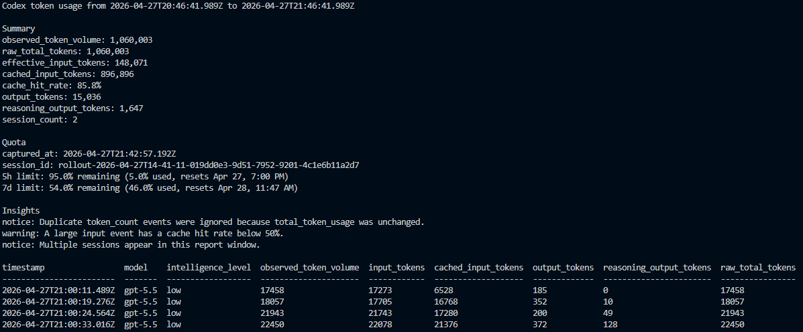
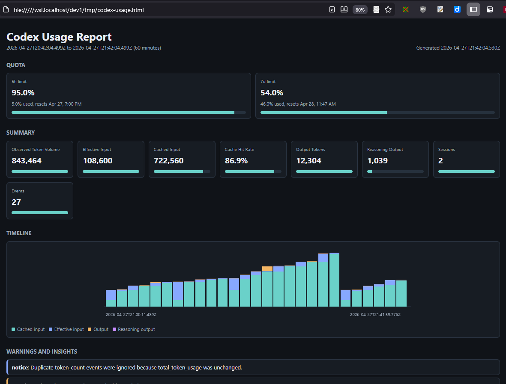

# codex-usage v1.0.5

## What This Project Does

`codex-usage` is a local Node.js CLI for reviewing Codex token usage from Codex session JSONL files. It reads recent session activity, normalizes token count events, and renders usage reports as terminal text, JSON, or a standalone HTML dashboard.

Use it when you want to answer questions such as:

- How much token activity happened in the selected time window?
- Which sessions, models, or turns contributed the most usage?
- What Codex quota snapshot was visible in recent session data?
- Are there usage patterns worth noticing, such as duplicate token count events, stale quota data, large events, or missing metadata?

## What You Will See

The report includes:

- A window summary for the selected rolling time range.
- Token totals for input, cached input, effective input, output, reasoning output, and observed token volume.
- Account quota cards when Codex rate limit snapshots are available.
- Session, model, and event summaries.
- Warnings and notices for notable usage patterns.
- A sortable event table in the HTML report, with expandable details.
- Optional compact JSONL history snapshots for local trend storage.

### TUI Screenshot



### HTML Screenshot



## How To Use It

The command uses Node.js built-in modules only. No NPM package installation is required to run the direct entry point.

Run the entry point with Node.js:

```bash
node src/codex-usage.js
```

See [docs/getting-started.md](./docs/getting-started.md) for an introduction to all options. For the full command reference, read [docs/cli-reference.md](./docs/cli-reference.md).

Options include:

- Output to terminal or a file
- Send data to a custom folder
- Render plain text, JSON, or standalone HTML
- Only include data from the previous N minutes
- Regenerate the browser report every 10 seconds and make the open page refresh itself
- Maintain a compact local history snapshot of processed daa

## .env **_New in v1.1_**

Override default folders and settings in `.env`.  
Check updates for changes in `.env.example`.

## Data folders

Data is written by default to /tmp (.env DATA_PATH).
Codex session data is read from the current user's `.codex` folder by default, or from `.env` CODEX_HOME when configured.
Windows drive paths are supported in `.env` and CLI options. Quote paths that contain spaces.

```bash
DATA_PATH="C:\Users\example\Codex Usage"
CODEX_HOME="C:\Users\example"
```

## Documentation

Start with [docs/index.md](./docs/index.md), which links to:

- [Getting started](./docs/getting-started.md)
- [CLI reference](./docs/cli-reference.md)
- [Usage analytics report](./docs/analytics-report.md)
- [Implementation details](./docs/details.md)
- [Source aggregate utility](./docs/source-aggregate.md)

## Project Files

- `.env.example` **_New in v1.1_** shows the supported local configuration values. Copy to .env for first time usage and update .env as required when new env options are added.
- `src/codex-usage.js` is the direct CLI entry point for argument parsing and runtime startup.
- `src/usage-runner.js` coordinates report generation for one-time and interval runs.
- `src/report-renderer.js` selects the text, JSON, or HTML report renderer.
- `src/history-writer.js` writes optional compact JSONL history snapshots.
- `src/session-files.js` finds recent Codex session files.
- `src/session-parser.js` extracts token usage events, rate limit snapshots, and model metadata.
- `src/quota-snapshot.js` normalizes Codex rate limit snapshots for report output.
- `src/usage-loader.js`, `src/usage-normalizer.js`, `src/usage-metrics.js`, `src/usage-groups.js`, and `src/usage-insights.js` load, normalize, summarize, and annotate usage data.
- `src/report-text.js`, `src/report-json.js`, and `src/report-html.js` render the structured report model.
- `docs/` contains the user and maintainer documentation.

### Code Review

`src/aggregate.js` builds `src/aggregate.md` for source review. This is a single Markdown document containing the whole JS source tree, ordered with the main entry files first. It's only useful when someone wants to:

- Read the project in one continuous document instead of opening many files.
- Paste the full source into a review tool, AI assistant, issue, or documentation system.
- Inspect a snapshot of the source without needing repo navigation.
- Compare or archive the current implementation as a human-readable artifact.

It is not needed for runtime. It is a convenience artifact for your review, documentation, and external analysis of the source. It is regenerated into the repo with each vX.Y update.

## Dependencies

The run-time uses Node.js built-in modules only.

Package installation is optional, not required, and not supported as a package component.  
Only development scripts use the dev dependencies listed in `package.json`.  
PNPM is used in `package.json` scripts.
`pnpm run install` to use ESLint, Prettier, and other development tooling.

## Linked Command

The package exposes a `codex-usage` command through the `bin` field in `package.json`. Link it from a local checkout when that path matches your environment:

```bash
npm link
codex-usage
```

Remove the link later with `npm unlink --global codex-usage`.

## Work In Progress

This is a new project and not used by many people yet.  
Please discuss issues with @CaptainStarbuck in Discord OpenAI server, (https://discord.gg/openai) Channel #codex-discussions -  
and/or create Issues for changes, fixes, and enhancements in https://github.com/CaptainStarbuck/codex-usage/issues.

## License

This package is licensed under the MIT License. See [LICENSE](./LICENSE).
