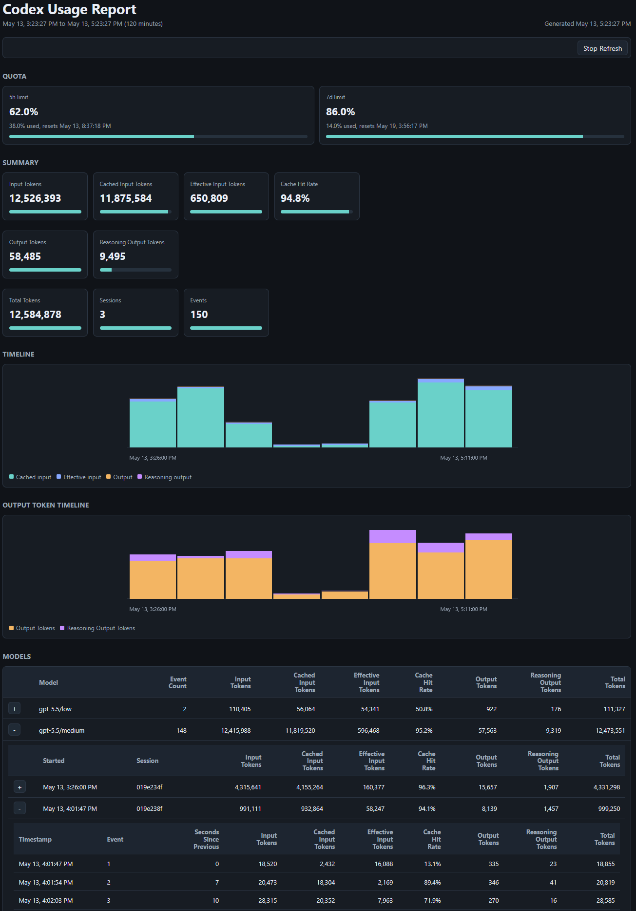
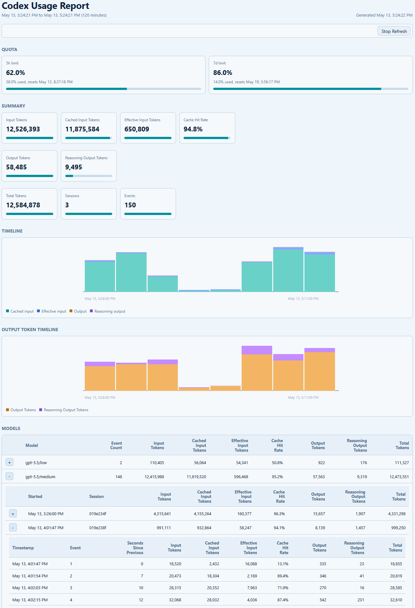

# Codex Usage v1.2.2-alpha.1 (Filtering)

> This build is dedicated to new session/event filtering and **will** change.  
> Please post comments in [Issues #4](https://github.com/CaptainStarbuck/codex-usage/issues/4).  
> Usage follows. See also [docs](docs/index.md) for CLI syntax.

```bash
Usage: node src/codex-usage.js [options]
 --minutes <min>       Show previous N minutes
 --from-date <date>    Start date or date/time (2026-05-13T19:00, 5/13, 5/13/26)
 --from-minutes <min>  Start at now minus minutes
 --to-date <date>      End date or date/time
 --to-minutes <min>    End at now minus minutes
 --scope <scope>       Range scope: events or sessions (default --scope sessions)
 --in-scope            Include only complete sessions (default not in scope)
 --max-events <count>  Max events per detail table (alpha default is 500)
 --max-sessions <num>  Max sessions per table      (alpha default is 500)
 --max-files <count>   Max session files scanned
 --max-turns <count>   Max turns per detail table  (alpha not yet supported)
 --max-models <count>  Max model groups per table
 --codex-home <path>   Codex home folder to scan
 --data-path <path>    App data and history folder
 --format <format>     Output: text, json, or html (default text)
 --out <path>          Write report to file        (default /tmp/codex-usage)
 --styles <style>      HTML style: light, dark, or path (default dark)
 --style <style>       Alias for --styles
 --interval <sec>      Regenerate output every N seconds
 --force-refresh       Add browser refresh to HTML output
 --save-history        Append local history snapshot
 --history <path>      History file path and enable save
 -h, --help            Show this help and quit
```

Examples:

```bash
$ node src/codex-usage.js \
    --from-date 2026-05-13T19:00:00 \
    --to-date 2026-05-13T21:00:00 \
    --scope sessions \
    --in-scope \
    --max-events 1900
Codex token usage from May 13, 7:00:00 PM to May 13, 9:00:00 PM

$ node src/codex-usage.js --from-date 5/1 --to-date 5/6
Codex token usage from May 1, 12:00:00 AM to May 6, 12:00:00 AM // beginning of day
```

## TL;DR

This is a utility for developers who use Codex, to see token usage and available quotas.

`node src/codex-usage.js --format html --out report.html --interval 5 --force-refresh --style dark --minutes 30`

That command generates /tmp/report.html or C:\temp\report.html. Screenshots are below. Open that in your browser and watch the report show your token usage live.  
(_press any key and wait an interval for it to stop_)

CLI users: a subset of that outputs to the TUI.

Docs here are extensive. Please read the docs.  
Discuss issues and desires with @CaptainStarbuck and others in the [Discord OpenAI server](https://discord.gg/openai) Channel #codex-discussions -  
and/or create Issues for changes, fixes, and enhancements in https://github.com/CaptainStarbuck/codex-usage/issues.

**The HTML report shows**

- Input tokens, minus Cache, equals Effective Input Tokens.
- Output tokens and Reasoning Output Tokens
- The same data broken down by models, sessions/threads, and events within each thread.

More is on the way, including details to see what instructions are being processed, graphing data in different ways, and exporting more data for your own processing.

---

## What This Project Does

`codex-usage` is a local Node.js CLI for reviewing Codex token usage from Codex session JSONL files. It reads recent session activity, normalizes token count events, and renders usage reports as terminal text, JSON, or a standalone HTML dashboard.

Use it when you want to answer questions such as:

- How much token activity happened in the selected time window?
- Which sessions, models, or turns contributed the most usage?
- What Codex quota snapshot was visible in recent session data?
- Are there usage patterns worth noticing, such as duplicate token count events, stale quota data, large events, or missing metadata?

## Changelog

See CHANGELOG.md and docs for information about version updates.

## What You Will See

The report includes:

- A window summary for the selected rolling time range.
- Token totals for input, cached input, effective input, output, reasoning output, and observed token volume.
- Account quota cards when Codex rate limit snapshots are available.
- Session, model-level, and event summaries.
- Warnings and notices for notable usage patterns.
- A sortable Sessions table in the HTML report, with expandable event details.
- Dynamic HTML report styling, currently with two available files, one light and one dark.
- Optional compact JSONL history snapshots for local trend storage.

### TUI Screenshot


### HTML Screenshot (dark)



<details>
<summary>Click to see the light version</summary>



</details>

## How To Use It

The command uses Node.js built-in modules only. No NPM package installation is required to run the direct entry point.

Run the entry point with Node.js:

```bash
node src/codex-usage.js
```

See [docs/getting-started.md](./docs/getting-started.md) for an introduction to all options. For the full command reference, read [docs/cli-reference.md](./docs/cli-reference.md).

Options include:

- Output to terminal or a file
- Send data to a custom folder
- Render plain text, JSON, or standalone HTML
- Include data from rolling, absolute, or bounded time ranges
- Choose event-based or session-based range matching
- Require complete sessions inside a selected range
- Guard large detail tables with configurable event and session limits
- Regenerate the browser report every 10 seconds, make the open page refresh itself, and pause or resume browser refreshes from the page
- Maintain a compact local history snapshot of processed data

The repository includes `src/utils/jsonl2json.js` as a convenience utility for converting Codex session JSONL files to formatted JSON. See [docs/jsonl2json.md](./docs/jsonl2json.md).

## .env **_New in v1.1_**

Override default folders and settings in `.env`, which is created for you. Review `.env.example` for available values.

## Data folders

Data is written by default to `/tmp/codex-usage` through `.env` `DATA_PATH`. On Windows, first-run `.env` creation writes `C:\Temp\codex-usage` to `DATA_PATH`.
Codex session data is read from the current user's `.codex` folder by default, or from `.env` CODEX_HOME when configured.
HTML report styling is selected by `.env` `STYLES`.
The `.env` file supports `DATETIME_FORMAT`.
Range filtering defaults can be configured with `RANGE_SCOPE`, `IN_SCOPE`, `MAX_EVENTS`, `MAX_SESSIONS`, `MAX_FILES`, `MAX_TURNS`, and `MAX_MODELS`.
Windows drive paths are supported in `.env` and CLI options. Quote paths that contain spaces.
Invalid OS paths for output folders result in a runtime error.

```bash
DATA_PATH="C:\Users\example\Codex Usage"
CODEX_HOME="C:\Users\example"
STYLES=styles-dark-01.css
DATETIME_FORMAT=MMM D, h:mm AP
RANGE_SCOPE=events
IN_SCOPE=false
MAX_EVENTS=500
MAX_SESSIONS=500
MAX_FILES=0
MAX_TURNS=0
MAX_MODELS=0
```

## Documentation

Start with [docs/index.md](./docs/index.md), which links to:

- [Getting started](./docs/getting-started.md)
- [CLI reference](./docs/cli-reference.md)
- [Usage analytics report](./docs/analytics-report.md)
- [Implementation details](./docs/details.md)
- [Source aggregate utility](./docs/source-aggregate.md)

## Dependencies

The run-time uses Node.js built-in modules only.

Package installation is optional, not required, and not supported as a package component.  
Only development scripts use the dev dependencies listed in `package.json`.  
PNPM is used in `package.json` scripts.
`pnpm run install` to use ESLint, Prettier, and other development tooling.

## Linked Command

The package exposes a `codex-usage` command through the `bin` field in `package.json`. Link it from a local checkout when that path matches your environment:

```bash
npm link
codex-usage
```

Remove the link later with `npm unlink --global codex-usage`.

## License

This package is licensed under the MIT License. See [LICENSE](./LICENSE).
